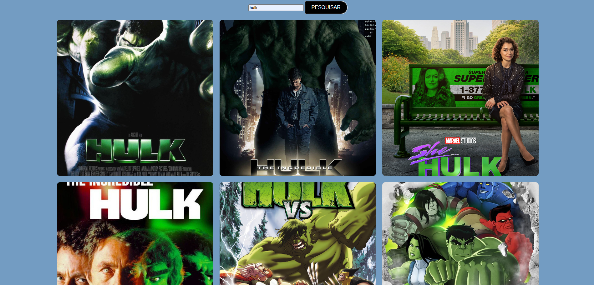

# Filmes API

---

### Sobre
Projeto do curso de Desenvolvimento de Sistemas do SENAI de Jandira com o objetivo de trocar a cor do body com javascript
[SENAI Jandira](https://sp.senai.br/unidade/jandira/)

---
## Tecnologias utilizadas
- HTML
- CSS
- JS

---
## Autor 
- [Rafaella Reis](https://github.com/faellareis)# cores-bb
# Filmes API

